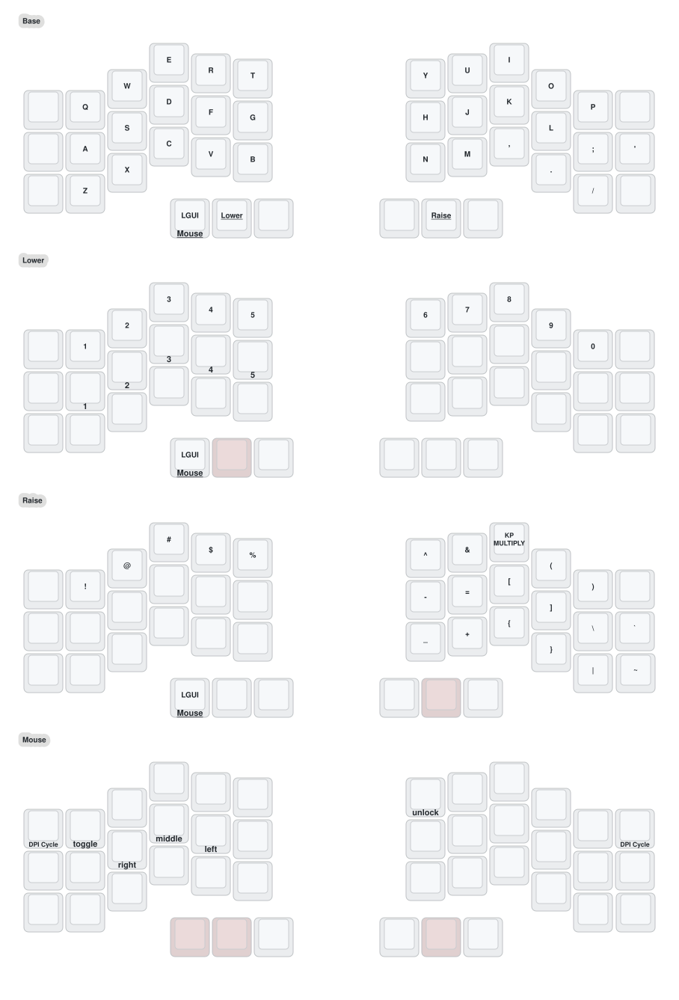

# crosses-42-zmk-template

### Default Firmware Keymap


## Keymap image file

The keymap image file is generated from `./config/crosses_v2.keymap` using the [keymap drawer](https://github.com/caksoylar/keymap-drawer) pipx package.

To rebuild `./keymap-drawer/crosses.yaml`, run:

```shell
keymap parse -z ./config/crosses_v2.keymap -o ./keymap-drawer/crosses.yaml
```

Some changes to the yaml file created by this command will override nicer-looking customizations, so you should revert those line changes individually.

To rebuild `./keymap-drawer/crosses.svg`, run:

```shell
keymap draw -j ./config/info.json -o ./keymap-drawer/crosses.svg ./keymap-drawer/crosses.yaml
```
